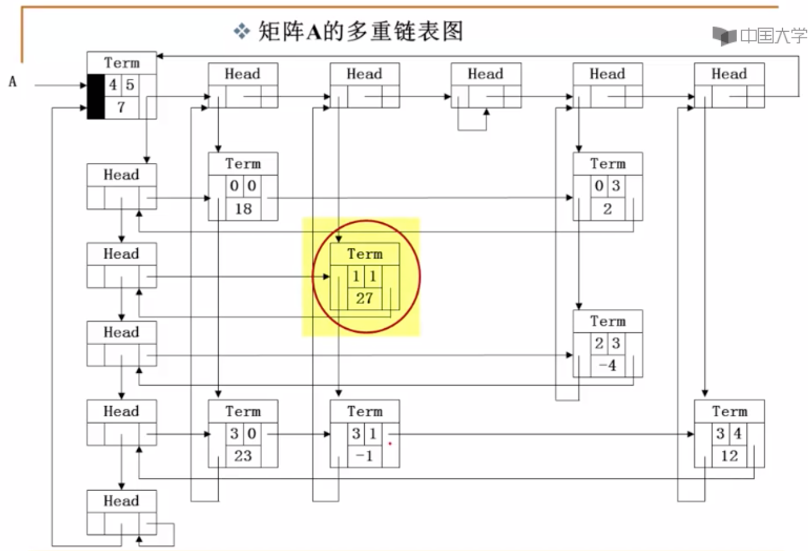

[TOC]

## 线性表 Linear List

考虑一元N阶多项式，


## 广义表 Generalized List

考虑二元N阶多项式，

### 定义

- 是线性表的推广
- 线性表中，每个元素都是基本的**单元素**，而广义表中的元素既可以是**单元素**也可是线性表


### 多重链表

- 定义
  - 链表中的节点可能同时隶属于多个链
  - 多重链表中节点的**指针域**有多个，但包含多个指针域的链表不一定是多重链表，比如双向链表
  - 用途：像树、图这些相对复杂的数据结构**都可以采用多重链表方式实现存储**

- 举例：（稀疏）矩阵





## 栈 Stack

- 具有一定操作约束的线性表，只在一端（栈顶，POP）做插入(push)和删除(pop)操作。

- 后入先出（LIFO）

### 定义

- 数据对象集：一个有0个或多个元素的有穷线性表

- 操作集：

  ```c
  // 生成空栈，其最大长度可为MaxSize
  Stack CreateStack( int MaxSize)
  // 判断是否已满
  int isFull(Stack S, int MaxSize)
  // 判断是否为空
  int isEmpty(Stack S)
  // 入栈
  void Push(Stack S, ElementType element)
  // 出栈
  ElementType Pop(Stack S)
  ```

### 实现

- 顺序存储实现

  ```c
  #define MAXSIZE 100
  struct Stack
  {
    int data[MAXSIZE];
    int top = -1;
  };
  ```

- 链式存储实现

  栈的链式存储实际上是一个单链表，也叫做链栈，插入和删除操作只能在链栈的**栈顶**进行。

  ```c
  struct Node
  {
    // 数据域
    int data;
    // 指针域
    struct Node *next;
  };
  typedef struct Node *pNode;
  
  pNode CreateStack()
  {
    // 构建头节点并返回
    pNode node = (pNode)malloc(sizeof(struct Node));
    node->next = NULL;
    return node;
  }
  
  int isEmpty(pNode S)
  {
    return (S->next == NULL);
  }
  
  pNode push(pNode S, int data)
  {
    pNode node = (pNode)malloc(sizeof(struct Node));
    node->data = data;
    node->next = S->next;
    S->next = node;
  }
  
  int pop(pNode S)
  {
    if (S->next)
    {
      pNode tmp = S->next;
      int data = tmp->data;
      S = tmp->next;
      free(tmp);
      return data;    
    }
  }
  ```

### 应用举例---表达式求解

- 中缀表达式 -> 后缀表达式

  顺序读取中缀表达式中的每个元素，对不同的元素类型做不同处理，

  - 运算数：直接输出
  - 左括号：入栈
  - 右括号：将栈顶的元素弹出并输出，直到遇到左括号（弹出，但不输出）
  - 运算符：
    - 若优先级大于栈顶元素，入栈；
    - 若优先级小于等于栈顶元素，栈顶运算符弹出并输出，再比较新的栈顶元素，直至该运算符大于栈顶运算符为止，然后将该运算符入栈；
  - 若表达式中的元素全部读取完毕，栈中的元素出栈并输出。


## 队列 Queue

### 定义

- 具有一定操作约束的线性表，只能在一端插入、另一端删除。
- FIFO

### 实现


