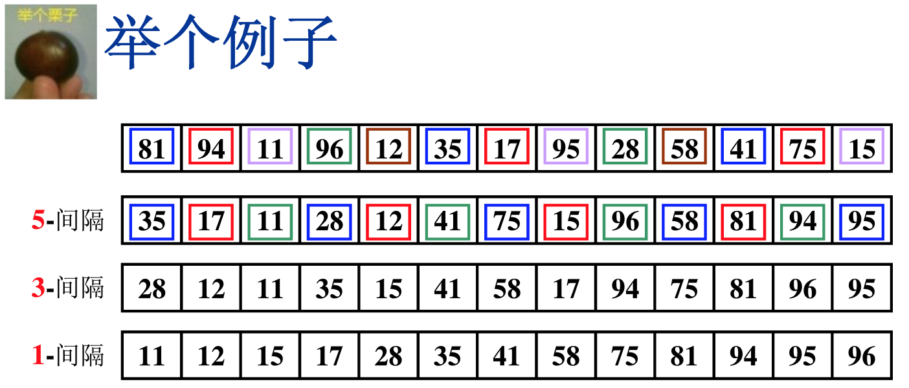

# 排序

[TOC]

## 冒泡排序

第一次依序遍历所有的N个元素，比较相邻两元素大小并排序，待此次遍历完成，最大的元素便被排在最后；然后，第二次依序遍历前面的N-1个元素，次大元素被排在了倒数第二的位置；继续按上述方法遍历，直到完成排序。

```python
def bubble_sort(lst, N):
	# lst: 列表，包含了N个元素
    for p in reversed(range(1,N)):
        flag = 0
        for i in range(p):
            if lst[i] > lst[i+1]:
                lst[i], lst[i+1] = lst[i+1], lst[i]
                flag = 1
        if flag:
            break
    return lst
```

1. 时间复杂度分析：
    - 最坏情况：逆序，$T = O(n^2)$
    - 最好情况：顺序，$T = O(n)$
2. 稳定性：稳定

## 插入排序

插入排序，非常像摸扑克牌时向手中已有的排过序的扑克牌中插入新的扑克牌的操作。对于有N个元素的序列，第一个元素不需要额外处理，从第二个元素x起，与前面的每个元素顺序（自后向前）对比，直到遇到小于等于x的元素，然后把比较过的元素向后移一位，将元素x插进来。以此方式将N-1个元素插入进来。

```python
def insertion_sort(lst, N):
    for p in range(1,N): 
        for i in reversed(range(p)):
            if lst[i] <= lst[p]:
                i += 1
                break
        lst[i], lst[i+1:p+1] = lst[p], lst[i:p]
    return lst
```

1. 时间复杂度分析
    - 最坏情况：$T = O(n^2)$
    - 最好情况：$T = O(n)$

2. 稳定性：稳定

### 时间复杂度下界

对于下标$i < j$，如果$A[i] > A[j]$，则称$(i, j)$为**逆序对**。冒泡排序中，交换两个相邻元素便消除了一个逆序对，逆序对的个数等于交换的次数。如果序列基本有序，则插入排序简单且高效。

定理1：任意N个不同元素组成的序列，平均具有$N(N-1)/4$个逆序对。

定理2：任何仅以交换相邻两元素来排序的算法，其平均时间复杂度为$\Omega(N^2)$

这就意味着要提高算法效率，每次必须要消除不止一个的逆序对，每次交换相邻较远的两元素。

## 希尔排序

定义增量序列$D_M > D_{M-1} > … > D_1 = 1$，对每个增量进行“$D_k$-间隔”插入排序。这样一来，每次的元素交换可以消除不止一个的逆序对，提高了排序的速度。



```python
def shell_sort2(lst, N):
    D = [929, 505,209,109,41,19,5,1,0]
    idx = 0
    while D[idx] > N:
        idx += 1

    while D[idx] >= 1:
        # insertion sort
        D_cur = D[idx]
        for p in range(D_cur, N):
            tmp = lst[p]
            for i in range(p-D_cur,-1,-D_cur):
                if lst[i] > tmp:
                    lst[i+D_cur] = lst[i]
                else:
                    i = i + D_cur
                    break
                lst[i] = tmp
        idx += 1
    return lst
```

### 增量序列

- 希尔增量序列

    $D_M = N/2, D_k = D_{k+1}/2$

- Hibbard增量序列

    $D_k = 2^k - 1$，相邻元素互质

- Sedgewick增量序列

    ${1, 5, 19, 41, 109, …} or  4^i -3 * 2^i + 1$

1. 时间复杂度：
2. 稳定性：不稳定

## 堆排序

堆排序本质是选择排序，从序列中选出最大元素，并取出，然后在剩余的元素中选出最大元素... ...，选出最大元素的方法是：对序列建立最大堆，根节点便是最大元素。

```python

```


## 归并排序

两个有序子序列的合并

### 递归算法

### 非递归算法


## 快速排序

 


## 表排序

间接排序


## 基数排序

