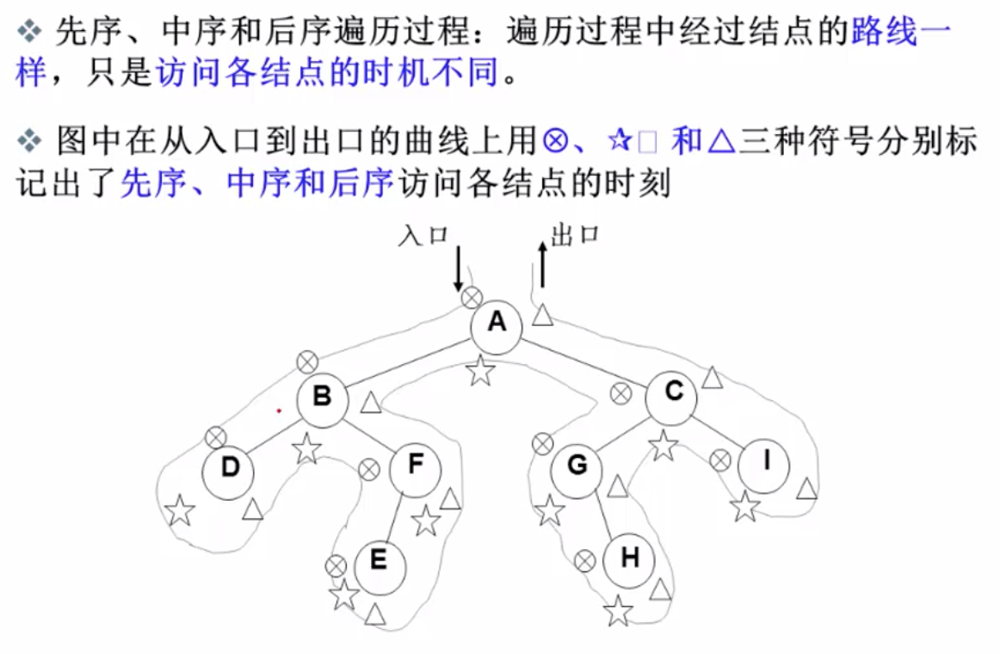
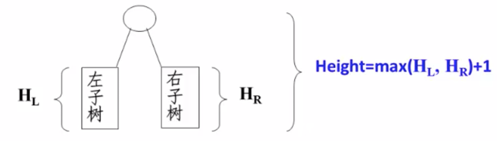
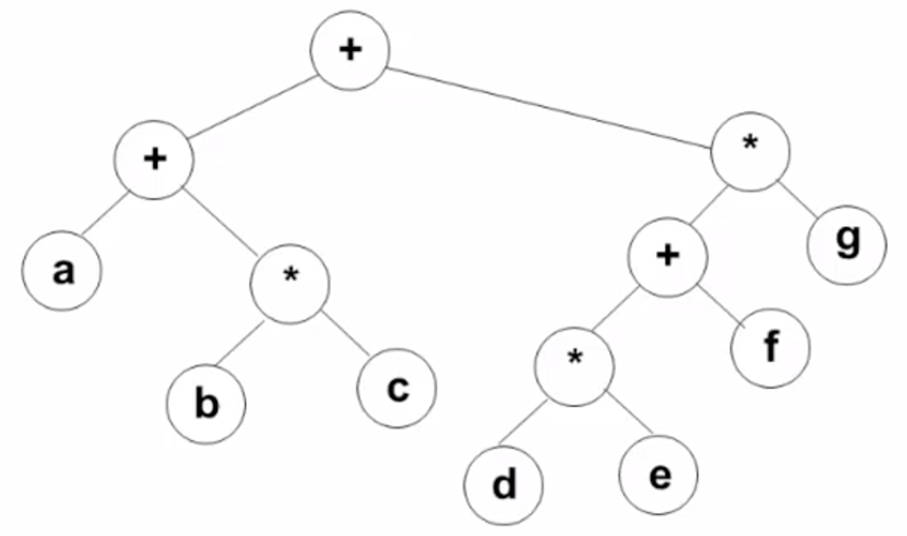

[TOC]

## 定义 & 基本术语

- 有且只有一个成为**根**的节点，有若干个互不相交的**子树**，且每个节点（除根节点）**只有一个父节点**，但可以有多个子节点
- 二分查找与二叉树的关系


- 祖先节点（ancestor）：沿树根到某一节点的路径上的所有节点都是这个节点的祖先节点
- 子孙节点（descendant）：某一节点的子树中的所有节点都是其子孙节点
- 节点的层数（level）：根节点的层数为1，其他节点的层数是在其父节点的层数上加1
- 树的深度（depth）：所有节点中的最大层数
- 儿子-兄弟表示法
- 双亲表示法：地址域的指针指向父节点。
- 儿子表示法：地址域包含指向所有孩子节点的指针。
- 分类：
  - 一般树：节点的子节点数没有限制
  - 二叉树：节点的子节点数最多为2
  - 森林：n个**互不相交**的树的集合


## 二叉树

### 定义

二叉树的子树有**左右顺序**之分。

特殊二叉树：


### 性质

1. 一个二叉树第i层的节点数最多为2^i-1^个
2. 深度为k的二叉树的总节点数最大为2^k^-1个
3. 对于非空二叉树，若n0为叶节点的个数，n1为度为1的非叶节点的个数，n2为度为2的非叶节点的个数，那么：
   1. 总节点数为：n0 + n1 + n2
   2. n0 = n2 + 1

### 抽象数据类型定义

类型名称：二叉树

数据对象集：一个有穷的节点集合，若不为空，则由根节点和左、右二叉子树组成。

操作集：

```c
// 查看树是否为空
Bool isEmpty(BinTree BT) 
// 遍历树中的每个节点
void travrsal(BinTree BT)
```

### 遍历方式

- 先序遍历：根、左子树、右子树

```c
void preOrderTraversal(BinTree BT)
{
  if (BT)
  {
    printf("%d", BT->data);
    preOrderTraversal(BT->leftChild);
    preOrderTraversal(BT->rightChild);
  }
}
```

- 中序遍历：左子树、根、右子树

```c
void inOrderTraversal(BinTree BT)
{
  if (BT)
  {
    inOrderTraversal(BT->leftChild);
    printf("%d", BT->data);
    inOrderTraversal(BT->rightChild);
  }
}
```

- 后序遍历：左子树、右子树、根

```c
void postOrderTraversal(BinTree BT)
{
  if (BT)
  {
    postOrderTraversal(BT->leftChild);
    postOrderTraversal(BT->rightChild);
    printf("%d", BT->data);
  }
}
```

- 层序遍历：从上到下、从左到右

  先是根节点入队列，然后，

  1. 从队列中抛出一个节点；
  2. 打印该节点;
  3. 将该节点的左、右孩子节点**顺序**入队。

```c
void levelOrderTraversal(BinTree BT)
{
  Queue Q;
  BinTree T;
  if (!BT)
  {
    return -1;
  }
  Q = createQueue(MaxSize);
  // 根节点先放入队列
  AddQ(Q, BT);
  while(!isEmpty(Q))
  {
    T = deleteQ(Q);
    printf("%d", T->data);
    if (T->left)
      AddQ(Q, T->left);
    if (T->right)
      AddQ(Q, T->right);
  } 
}
```




### 存储结构

1. 顺序存储结构

完全二叉树采用顺序存储结构很方便，普通二叉树可以转为完全二叉树后用此方式存储，但是非常浪费存储空间。

2. 链表存储结构

### 应用举例

- 求二叉树的深度



```c
int getBinTreeDepth(BinTree BT)
{
  height1 = BT->left?getBinTreeDepth(BT->left):0;
  height2 = BT->right?getBinTreeDepth(BT->right):0; 
  return max(height1, height2) + 1;     
}

int getBinTreeDepth(BinTree BT)
{
  if (BT)
  {
    heightL = getBinTreeDepth(BT->left);
    heightR = getBinTreeDepth(BT->right);
    maxHeight = heightL > heightR ? heightL : heightR;
    return maxHeight + 1;
  }  
}
```

- 二元运算表达式树及其遍历

叶子节点为数据，非叶子节点为操作符，如下图所示：



三种遍历方式得到不同的结果：

1. 先序遍历得到前缀表达式：+ + a * b c * + * d e f g
2. 中序遍历得到中缀表达式： a + b * c + d * e + f * g
3. 后序遍历得到后缀表达式：a b c * + d e * f + g * + 


